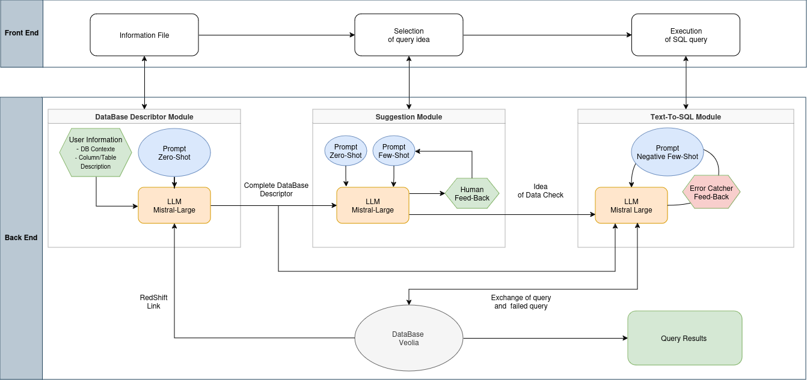

---

# 🚀 Veolia Project - Data Base Error Analyser  

Une application permettant d'analyser et de corriger les erreurs de bases de données en exploitant un modèle de langage (LLM).  

---

## 📌 Table des Matières  

- [📥 Installation](#installation)  
- [🚀 Utilisation](#utilisation)  
- [📂 Structure du Projet](#structure-du-projet)  
- [🤝 Contribuer](#contribuer)  

---

## 📥 Installation  

Suivez ces étapes pour installer et configurer le projet localement.  

```bash
# 1. Clonez le dépôt
git clone https://github.com/julesdamidaux/Mhackdonalds.git
cd Mhackdonalds

# 2. Créez un environnement virtuel
python -m venv venv

# 3. Activez l'environnement virtuel
source venv/bin/activate  # Sur macOS/Linux
venv\Scripts\activate      # Sur Windows

# 4. Installez les dépendances
pip install -r requirements.txt

# 5. Démarrez l'application front-end
streamlit run frontend/app.py
```

---

## 🚀 Utilisation  

Une fois l’application démarrée, suivez ces étapes :  

1️⃣ **Saisie des informations**  
   - Remplissez le nom de votre base de données sur **Redshift**.  
   - Ajoutez un fichier **JSON** décrivant votre base de données sous la forme suivante :  

   ```json
   {
       "tables": {
           "table_name1": {
               "create_statement": "CREATE TABLE statement",
               "example": [
                   ["col1", "col2"],
                   ["val1", "val2"]
               ],
               "columns": {
                   "col1": {
                       "column_description": "Description de la colonne",
                       "type": "Type de la colonne"
                   },
                   "col2": {
                       "column_description": "Description de la colonne",
                       "type": "Type de la colonne"
                   }
               }
           }
       },
       "contexte": "Description du contexte"
   }
   ```
   - Ajoutez un fichier `contexte.txt` décrivant l'utilisation de votre base de données.  

2️⃣ **Génération de requêtes SQL**  
   - L’application analyse les données et propose des **suggestions de requêtes SQL**.  
   - Vous pouvez sélectionner les meilleures requêtes et affiner les suggestions grâce à un **système de feedback et de few-shot learning**.  

3️⃣ **Exécution des requêtes**  
   - Une fois validées, les requêtes sont converties en SQL et exécutées sur la base de données **Redshift**.  

---

## 📂 Structure du Projet  

Voici un aperçu de l'architecture du projet :  

  

---

## 🤝 Contribuer  

Le projet est développé par :  
- **Jules D.**  
- **Rodrigue R.**  
- **Adrien G.**  
- **Maxence A.**  
